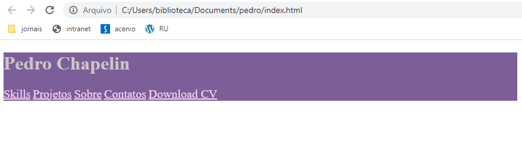
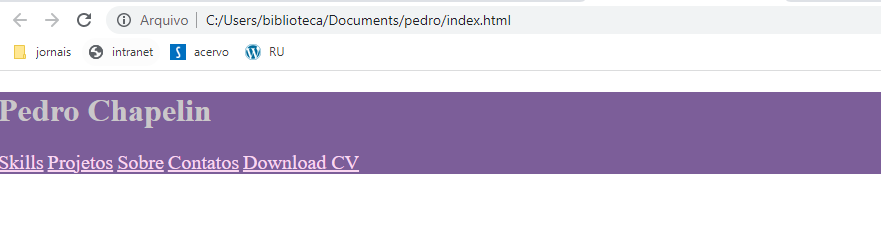

# CursoHTML-CSS

## Figma

## HTML

- Geralmente o nome da página principal, por convenção, é **index.html**
- O HTML é visto por *tags*, ou seja, tudo para ser representado deve ser assim:  
```html
<tag>
  (conteúdo)
</tag>
```
Algumas tags especiais não precisam da tag de fechamento, se não é estruturada 
como: `<começo>` **(meio)** `</fim>`, não precisa fechar.
  
- As *tags* podem possuir **atributos**, que vem logo em seguida do nome delas 
na tag de abertura, como por exemplo: `<a href="link">`.
  
- Na mesma pasta do **index.html**, criar uma pasta chamada **assets**.
Nela, ficarão todos os recursos a serem utilizados no site, como imagens
por exemplo.
  
  
### Tags

#### Estrutura básica das tags
  
```html
<!DOCTYPE html>

<html>
    <head>
        <title>Titulo da Aba</title>
        <meta charset="utf-8">
    </head>

    <body>
        <header>
            --Cabeçalho
        </header>
      
        -- Resto do site
    </body>
</html>
```
> Esta estrutura é a **CERTA** de HTML, a válida para ser usada.
> No **VSCode**, digitar `! + tab` gera isso automaticamente.

- `<!-- -->` --> Comentário;

- `<!DOCTYPE html>` --> Define a versão mais estável do *HTML*;

- `<head>` --> Tudo que é configuração, vem antes do *<body>*;
  
- `<title>` --> Título da aba.
  
- `<meta charset="utf-8">` --> Define o *locale* do website.   
  
- `<body>` --> *corpo* do HTML, aonde as inf gerais do site estão;
  
- `<header>` --> Indica tudo que está dentro da parte do cabeçalho.
  
- `<h1>`, `<h2>`, ..., `<h6>` --> Heading (cabeçalhos ou títulos);
> Um bom site não passa de *h3*;
  
- `<p>` --> Parágrafo;
  
- `<em>` --> Tag de **ênfase**
> Exemplo: mudar o idioma de uma palavra escrita em inglês no meio 
de um parágrafo todo em português: `<em lang="em"> FrontEnd </em>`
  
- `<nav>` --> Navegação;
> É usada para botões que te façam **nav**egar pelo site;
    
- `<a>` --> *Anchor*, ou tag que é usada para links que te levam a 
outros lugares, fica dentro da tag `<nav>` também;
> `<a href=" ">` Skills `</a>` transforma *Skills* em um botão que te
leva para algum lugar indicado pelas "" após *href*
  
- `` --> Insere uma imagem;
> ```</img>` Puxa uma imagem do **PATH** inserido.
  
- `<span>` --> delimitador;

### Atributos

  Atributos são modificadores dos conteúdos das tags, são divididos em 
**locais** e **globais**.  
  
  Os globais podem ser usados em qualquer tag, como por exemplo o
atributo `lang="pt-BR`, que altera a linguagem do conteúdo da tag.  
  Já os locais só podem ser usados em tags específicas, como o
`href="link"` da tag *<a>*.


## CSS

[Site com explicações de propriedades](https://developer.mozilla.org/pt-BR/docs/Web/CSS/text-decoration)

- Cuida do **visual** do site.  
  
### Primeiro jeito:
  
- Seus comandos são escritos nos **atributos** das tags do HTML:

```html  
<header style="background-color: rgb(171, 106, 255);">
```
> Sempre será nesse estilo, `<tag atribut= propriedade CSS: valor>`

### Segundo jeito:
  
- Abrir uma tag `<style>` antes:

```html
<!-- Aqui eu disse que quero style só na tag a-->
<!-- propriedade: valor-->
<style>
    a {
      color: white;
    }
</style>
```
  
### Terceiro jeito (melhor):
  
- Criar um arquivo separado com o mesmo nome do *.html*, para os *css*
  
- Funciona como uma função, a definição dela está no arquivo, e para chamá-la,
necessário fazer:

```html
<link rel="stylesheet" href="PATH">
```
>index.html

```css
a {
  color: white;
}
```
>index.css

### Reset.css

- O arquivo adicional *reset.css* serve para consertar alguns detalhes 
específicos de navegadores, como por exemplo o caso da margem:


> Observe a margem aos lados, não queremos ela no site.
  
Para isso, criamos o *reset*, inserindo-o no arquivo da mesma maneira 
que inserimos o *index*:
  
`<link rel="stylesheet" href="css/reset.css">`
  
E dentro desse arquivo, colocamos as propriedades que queremos definir
para cada tag:
  
```css
body {

    margin: 0;
}
```
  
- Agora note como ficou o site:
  

> As margens sumiram.
  
- Geralmente é copiado algum reset.css, pois alguns são muito gerais e já
tratam de qualquer bug que o site possa ter. O mais famoso é o do [Eric Mayer](https://meyerweb.com/eric/tools/css/reset/)

### Cores
  
- Há três jeitos de representar as propriedades de cor no **CSS**
  
1. **Nome**
  
`color: white;`
  
2. **Decimal**
  
`color: rgb(0, 0, 0);`
  
3. **Hexadecimal**
  
`color: #000000`

### Fontes

- Para utilizar uma fonte que talvez não tenha baixado no computador,
utilizamos as fontes do site [Google fonts](https://fonts.google.com/)

Para isso é necessário primeiro estabelecer um link com o download online
da fonte, adquirido ao pesquisar o nome da mesma no site.

```html
<!-- Links obtidos do site -->
<link rel="preconnect" href="https://fonts.googleapis.com">
<link rel="preconnect" href="https://fonts.gstatic.com" crossorigin>
<link href="https://fonts.googleapis.com/css2?family=Fira+Code:wght@500&display=swap" rel="stylesheet">
```
  
Depois disso, podemos indexá-la no *index.css*

```css
/* Algumas propriedades definidas para a fonte*/
a {
  color: white;
  font-family:"Fira Code"; 
  font-weight: 500;
  font-size: 20px;
  font-style: normal;
  text-decoration: none;
  margin-right: 30px;
}
```
  
### Isolando tags
  
- Quando se quer fazer algo muito específico com alguma tag, nós usamos o
atributo **id**

```html
<!-- Querendo pegar só o 'Download CV' -->
<nav>
  <a href="" lang="en">Skills</a>
  <a href="">Projetos</a>
  <a href="">Sobre</a>
  <a href="">Contatos</a>
  <a id="button" href="" lang="en">Download CV</a>
</nav>
```
> Com a *id*, demos o nome daquela tag específica de 'button'

Dessa maneira, conseguimos mexer nela especificamente no *.css*

```css
#button {
  display: inline-block;
  background-color: #F25A70;
  height: 60px;
  line-height: 60px;
  padding-left: 20px;
  padding-right: 20px;
  box-shadow: 5px 5px 0 black;
}
```
  
- Também podemos criar **Pseudo-nomes** dentro das tags com o CSS.

```css
a::before {

    content:"";
    display: inline-block;
    background-color: #F25A70;
    margin-right: 10px;
    width: 10px;
    height: 10px;
}
```
> Essa linha de comando diz que no início do conteúdo da tag *a*, eu quero 
colocar um quadrado pequeno vermelho. Se eu quisesse no final do conteúdo,
o comando seria `a::after`.

### A propriedade display

- Algumas tags ocupam a linha inteira quando você quer mudar alguma propriedade,
para evitar isso, precisamos chamar a propriedade **display** dentro do css.

```css
#button {
  display: inline-block;
}
```
> Assim, a id *button* passa a tratar apenas do conteúdo dela, não da linha inteira.

Normalmente o **display** já vem setado como *inline* por natureza, quando este é o caso,
não é possível alterar o *width* e o *height*.
> display *block* ocupa a linha inteira

- Já o **inline-block** mistura característica dos dois, deixa na mesma linha, e permite
alterar largura e altura também.

### Isolando o CSS

Quando o código começa a ficar muito grande, uma boa prática é **isolar** o código CSS.
  
Feito em arquivos adicionais *.css*, ainda facilita o reaproveitamento do código, podendo
utilizar títulos genéricos por exemplo.

```css
#box {

    display: inline-block;
    background-color: #3A4042;
    box-shadow: 8px 8px 0 black;
    text-align: center;
    padding: 42px 44px;
    margin-top: 116px;
    margin-left: 91px;
}

#box h1 {

    margin-bottom: 28px;
}
```
> Código CSS para definição de uma caixa de um tamanho específico de acordo com o texto

- Observando o código também se percebe um novo jeito de definir variáveis, o **h1** que 
está dentro da **#box**, assim, fica fácil de editar coisas específicas sem alterar o 
código fonte que define o **h1**.
  


## Anotações gerais
  
- Em um site, é melhor atualizar a página com `Ctrl + R` do que com `F5`,  
pois esse mantém o *cache* da página anterior, podendo não atualizar para  
a versão mais recente.
  
- Para programar com HTML no **VSCode**, fica muito mais fácil utilizando
a extensão ja instalada *Emmet*, digitando menos código. 
